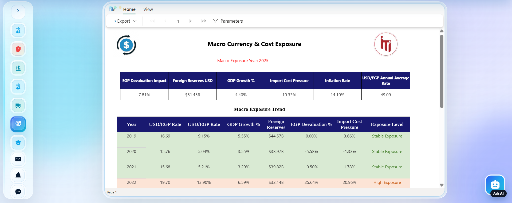
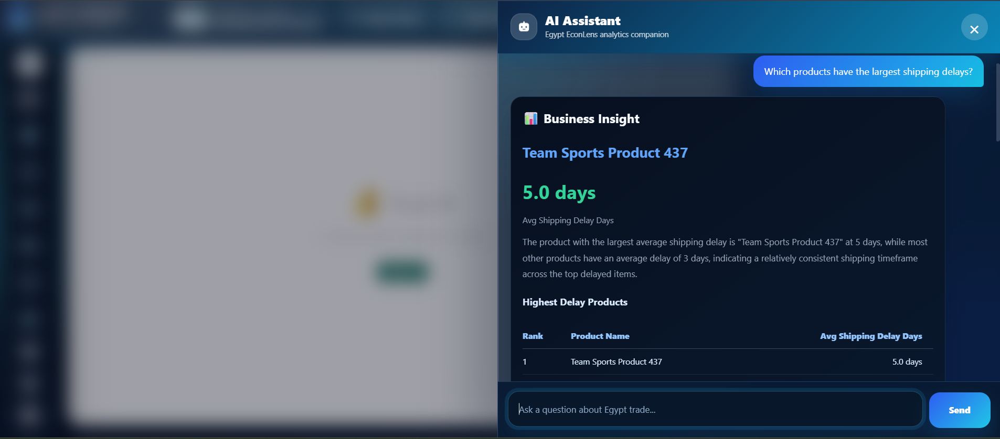
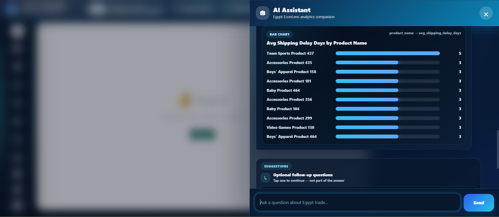
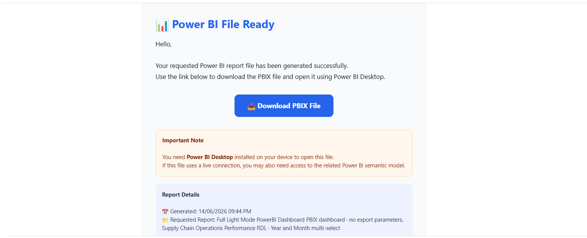
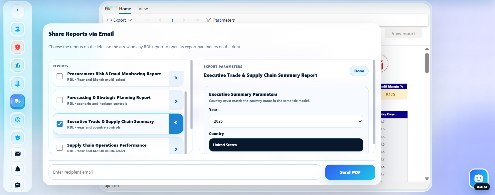

# Egypt EconLens
> **Economic Intelligence & Supply Chain Analytics Platform**

Egypt EconLens is a comprehensive, end-to-end Business Intelligence platform hosted on Azure. It bridges the gap between raw economic data and decision-ready intelligence by integrating trade flows, macroeconomic indicators, and supply-chain risk analytics into a single unified analytical environment.

---

## 🚀 Project Showcase

<p align="center">
  
  
</p>
<p align="center">
  
  
</p>
<p align="center">
  
  
</p>

---

## ✨ Key Features

- **Embedded Power BI Reports**: Seamless integration of interactive PBIX dashboards and paginated RDL reports.
- **AI Analytics Copilot**: A natural-language AI assistant that converts user questions into validated SQL, generating business insights, dynamic data tables, and QuickChart visualizations on the fly.
- **Executive Chat Summarizer**: Instantly export AI conversations as professional, Q&A formatted PDF executive briefs, securely delivered via email.
- **Power Automate Integration**: Automated flows for exporting dashboards, delivering single/multiple paginated PDF reports, and sending daily "New/Modified Report" alerts to subscribers.
- **SharePoint State Management**: Lightweight persistence layer for tracking report versions and managing subscriber preferences.

---

## 🛠️ Tech Stack & Architecture

- **Frontend & Backend**: Python 3.11, Flask, HTML/CSS (Custom UI)
- **Data Engineering**: SQL Server Data Warehouse, SSIS ETL
- **Reporting**: Microsoft Fabric, Power BI Service (PBIX & Paginated RDL)
- **Automation**: Power Automate, SharePoint Lists
- **AI & LLM**: OpenRouter API, Prompt Engineering
- **Cloud Hosting**: Azure App Service (Linux)

---

## 💡 Technical Highlight: Bypassing the Power BI Embedded Licensing Barrier

As students developing a public-facing platform within a university Azure tenant, we faced a frustrating wall: Microsoft requires viewers to be part of the tenant and authenticated, or requires purchasing an expensive Power BI Embedded capacity node.

**Here is how we solved it for free:**
1. Created a shared Demo Microsoft account.
2. Added it as a **Guest user** to our university tenant via Azure Active Directory (#EXT# account).
3. Granted the demo account Viewer access on the Fabric workspace.
4. Activated the **Microsoft Fabric Trial** (60 days free) and assigned it to the workspace—enabling paginated RDL reports to render correctly without a Premium capacity.
5. Integrated the demo account directly into our Azure-hosted web application, providing external visitors with a seamless **"View Demo Account"** access gate.

---

## ⚙️ Local Development Setup

### 1. Requirements
- Python 3.10+
- SQL Server & ODBC Driver 17
- OpenRouter API Key
- Power Automate HTTP trigger URLs

### 2. Installation
Create and activate a virtual environment:
```powershell
python -m venv .venv
Set-ExecutionPolicy -Scope Process -ExecutionPolicy Bypass
.\.venv\Scripts\Activate.ps1
```

Install dependencies:
```powershell
python -m pip install --upgrade pip
python -m pip install flask flask-cors python-dotenv openai flask-mail reportlab pyodbc pandas requests numpy sqlalchemy cachetools
```

### 3. Environment Variables
Create a `.env` file in the root directory using `.env.example` as a template:
```env
OPENROUTER_API_KEY=your_openrouter_api_key
HTTP_REFERER=http://localhost:5000
X_TITLE=EgyptTradeAI

SQL_SERVER=YOUR_SERVER_NAME
SQL_DATABASE=EgyptBI_DWH1

POWER_AUTOMATE_URL=your_power_automate_pdf_flow_url
UPDATE_SUBSCRIBERS_FILE=data/update_subscribers.json
SUBSCRIBERS_API_KEY=your_secret_key_for_subscribers_endpoint
```
*(Do NOT upload your `.env` file to GitHub!)*

### 4. Running the App
```powershell
python app2.py
```
Open `http://127.0.0.1:5000` in your browser.

---

## 🔒 Security Notes
- Managed Identity is used for Azure App Service to access resources passwordlessly.
- Never commit `.env` or hardcode API keys.

## 📝 License
This project is an academic graduation project and portfolio piece.
