<h1 align="center">
  <br>
  🇪🇬 Egypt EconLens
  <br>
</h1>

<h4 align="center">A Comprehensive Economic Intelligence & Supply Chain Analytics Platform</h4>

<p align="center">
  <strong>A complete Business Intelligence platform analyzing Egypt's trade dynamics, supply chain performance, and macroeconomic indicators (2019–2025)</strong>
</p>

<p align="center">
  <a href="#-overview"></a>
  
  
  
  
  
  
</p>

<p align="center">
  
  
  
  
</p>

<p align="center">
  <a href="https://egypt-econlens-epajh8gjfvdxdyhd.austriaeast-01.azurewebsites.net" target="_blank">
    
  </a>
</p>

---

## 🌟 Overview

**Egypt EconLens** is an end-to-end Business Intelligence platform built as an **ITI Graduation Project** and hosted on Microsoft Azure. It transforms raw trade data, supply chain records, and macroeconomic indicators into actionable insights through an automated data pipeline and interactive dashboards.

The platform bridges the gap between raw economic data and decision-ready intelligence by deeply integrating trade flows, macroeconomic indicators, and supply-chain risk analytics into one unified analytical environment. It features smooth view transitions, a natural-language AI Copilot, embedded Power BI dashboards, automated PDF report delivery via Power Automate, and a premium dark-mode UI — all built without any frontend frameworks.

### 🎯 Problem Statement

Egypt's trade ecosystem generates massive volumes of data across multiple agencies — **UN Comtrade**, the **World Bank**, and internal procurement systems. Decision-makers lack a unified view to:
- Track **trade balance trends** and identify deficit/surplus patterns
- Monitor **supply chain KPIs** (OTIF, late deliveries, fraud rates)
- Analyze the impact of **economic crises** (COVID-19, currency devaluations) on trade flows
- Identify **strategic commodities** and top trading partners
- Correlate **macroeconomic indicators** (GDP, inflation, USD/EGP rates) with trade performance

---

## 🚀 Visual Showcase

<p align="center">
  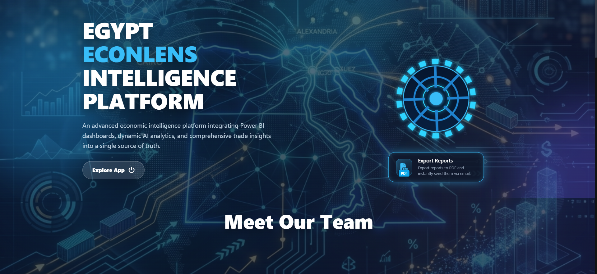
  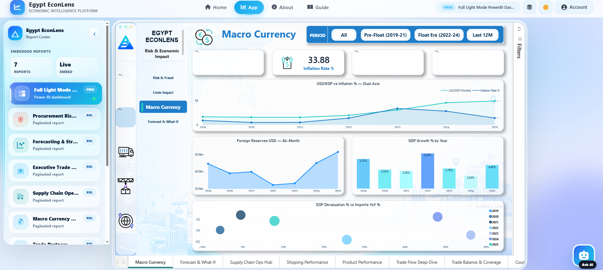
</p>
<p align="center">
  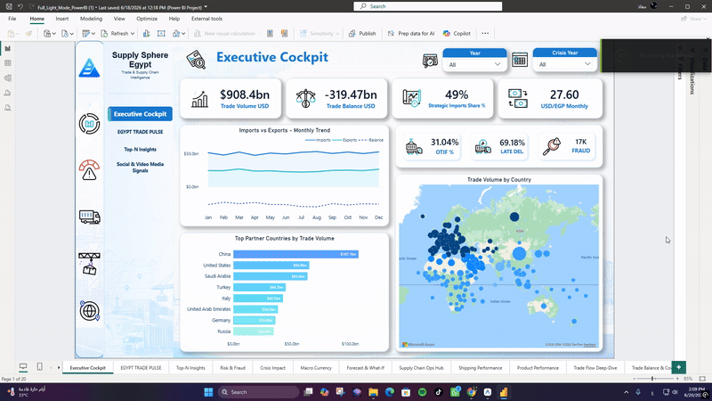
</p>

---

## ✨ Key Features

| Feature | Description |
|---|---|
| 📊 **Embedded Power BI Reports** | Seamless integration of interactive PBIX dashboards and paginated RDL reports into a custom UI. |
| 🤖 **AI Analytics Copilot** | Natural-language assistant that converts questions into validated SQL, generating insights, tables, and dynamic charts (Bar, Line, Area, Donut). |
| 📄 **Executive Chat Summarizer** | Export AI conversations as professional Q&A PDF briefs, delivered via email using Power Automate. |
| ⚡ **Power Automate Integration** | Automated workflows for dashboard export, paginated PDF delivery, and daily subscriber alerts. |
| 🌐 **View Transitions API** | Fluid, app-like page navigation without SPA framework overhead. |
| 🗄️ **Robust Data Warehouse** | Optimized Star Schema built with SQL Server 2022. |
| ⚙️ **Automated ETL Pipeline** | Built with SSIS including data validation and DQ checks. |

---

## 🏗️ Architecture & Tech Stack

### Web App Architecture
```text
┌─────────────────────────────────────────────────────────┐
│                     Azure App Service                    │
│  ┌───────────┐  ┌──────────────┐  ┌──────────────────┐  │
│  │  Flask     │  │  Middleware   │  │  Templates       │  │
│  │  (app2.py) │  │  • prompt_   │  │  • index.html    │  │
│  │           │  │    builder   │  │  • about.html    │  │
│  │           │  │  • sql_      │  │  • guide.html    │  │
│  │           │  │    validator │  │                  │  │
│  │           │  │  • schema_   │  │  Static Assets   │  │
│  │           │  │    retriever │  │  • style.css     │  │
│  └─────┬─────┘  └──────┬───────┘  │  • mobile.css    │  │
│        │               │          └──────────────────┘  │
└────────┼───────────────┼────────────────────────────────┘
         │               │
    ┌────▼────┐   ┌──────▼──────┐   ┌──────────────┐
    │ SQL     │   │ OpenRouter  │   │ Power BI     │
    │ Server  │   │ (GPT-4     │   │ Service      │
    │ DWH     │   │  class)    │   │ (Fabric)     │
    └─────────┘   └─────────────┘   └──────────────┘
                                    ┌──────────────┐
                                    │ Power        │
                                    │ Automate     │
                                    │ + SharePoint │
                                    └──────────────┘
```

### Data Pipeline Architecture
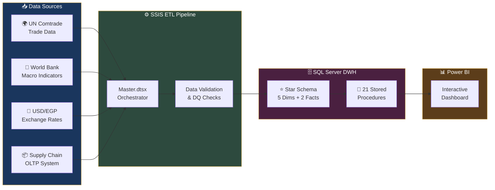
```mermaid
flowchart LR
    subgraph Sources["📥 Data Sources"]
        A["🌍 UN Comtrade\nTrade Data"]
        B["🏦 World Bank\nMacro Indicators"]
        C["💱 USD/EGP\nExchange Rates"]
        D["📦 Supply Chain\nOLTP System"]
    end

    subgraph ETL["⚙️ SSIS ETL Pipeline"]
        E["Master.dtsx\nOrchestrator"]
        F["Data Validation\n& DQ Checks"]
    end

    subgraph DWH["🗄️ SQL Server DWH"]
        G["⭐ Star Schema\n5 Dims + 2 Facts"]
        H["📝 21 Stored\nProcedures"]
    end

    subgraph BI["📊 Power BI"]
        I["Interactive\nDashboard"]
    end

    A --> E
    B --> E
    C --> E
    D --> E
    E --> F
    F --> G
    G --> H
    H --> I

    style Sources fill:#1a365d,stroke:#d4a843,color:#fff
    style ETL fill:#2d4a3e,stroke:#d4a843,color:#fff
    style DWH fill:#4a2040,stroke:#d4a843,color:#fff
    style BI fill:#5c3d1a,stroke:#d4a843,color:#fff
```

### 🖼️ System Architecture Screenshots
<p align="center">
  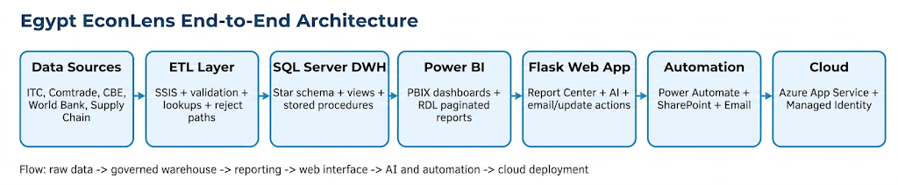
  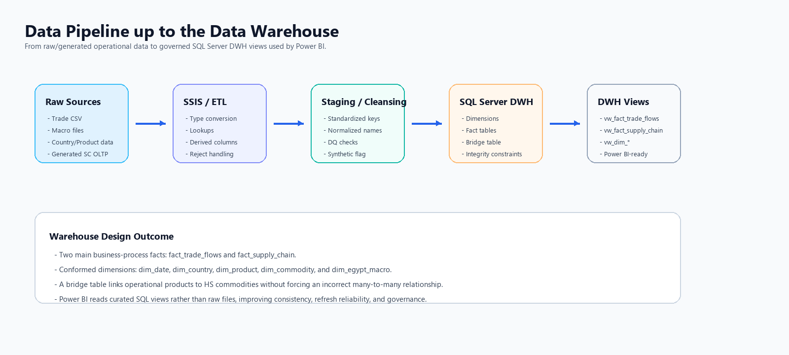
</p>

---

## ⭐ Data Warehouse Schema

The DWH follows a **Star Schema** design optimized for analytical queries:

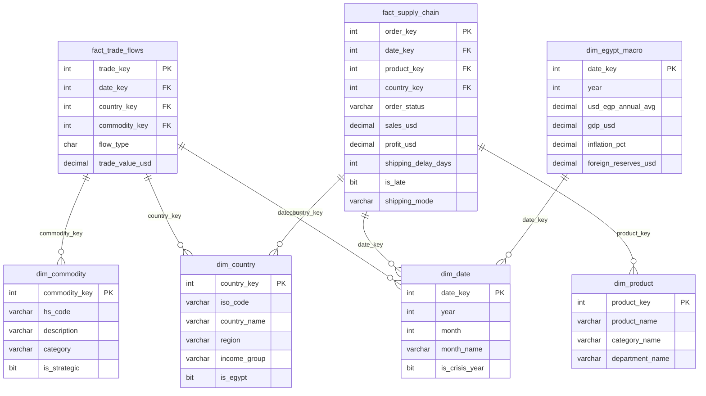
```mermaid
erDiagram
    fact_trade_flows {
        int trade_key PK
        int date_key FK
        int country_key FK
        int commodity_key FK
        char flow_type
        decimal trade_value_usd
    }

    fact_supply_chain {
        int order_key PK
        int date_key FK
        int product_key FK
        int country_key FK
        varchar order_status
        decimal sales_usd
        decimal profit_usd
        int shipping_delay_days
        bit is_late
        varchar shipping_mode
    }

    dim_date {
        int date_key PK
        int year
        int month
        varchar month_name
        bit is_crisis_year
    }

    dim_country {
        int country_key PK
        varchar iso_code
        varchar country_name
        varchar region
        varchar income_group
        bit is_egypt
    }

    dim_commodity {
        int commodity_key PK
        varchar hs_code
        varchar description
        varchar category
        bit is_strategic
    }

    dim_product {
        int product_key PK
        varchar product_name
        varchar category_name
        varchar department_name
    }

    dim_egypt_macro {
        int date_key PK
        int year
        decimal usd_egp_annual_avg
        decimal gdp_usd
        decimal inflation_pct
        decimal foreign_reserves_usd
    }

    fact_trade_flows ||--o{ dim_date : "date_key"
    fact_trade_flows ||--o{ dim_country : "country_key"
    fact_trade_flows ||--o{ dim_commodity : "commodity_key"
    fact_supply_chain ||--o{ dim_date : "date_key"
    fact_supply_chain ||--o{ dim_product : "product_key"
    fact_supply_chain ||--o{ dim_country : "country_key"
    dim_egypt_macro ||--o{ dim_date : "date_key"
```

<p align="center">
  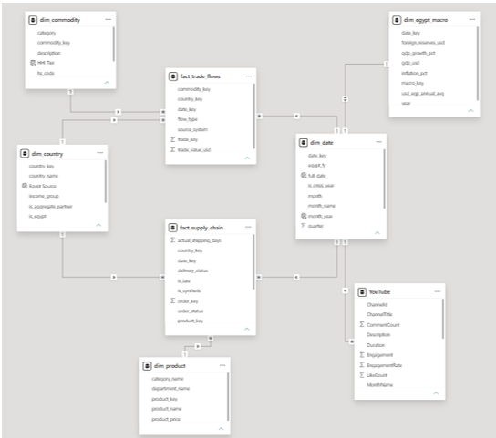
</p>

---

## ⚙️ ETL Pipeline (SSIS)

The ETL pipeline consists of **9 SSIS packages** orchestrated by a Master package:

| # | Package | Description |
|:---:|:---|:---|
| 🎯 | `Master.dtsx` | **Orchestrator** — executes all packages in dependency order |
| 1 | `010_Load_dim_date.dtsx` | Loads 84 monthly date records (2019–2025) |
| 2 | `020_Load_dim_country.dtsx` | Loads country dimension with ISO codes & regions |
| 3 | `030_Load_dim_commodity.dtsx` | Loads HS commodity codes with strategic flags |
| 4 | `040_Load_dim_egypt_macro.dtsx` | Loads World Bank macro indicators + exchange rates |
| 5 | `050_Load_dim_product.dtsx` | Loads product catalog from supply chain source |
| 6 | `060_Load_fact_trade_flows.dtsx` | Loads Comtrade trade data with FK lookups |
| 7 | `070_Load_fact_supply_chain.dtsx` | Loads supply chain orders with derived columns |
| 8 | `080_DQ_Validation.dtsx` | Runs data quality checks & logs results |

<details>
<summary>📸 Click to expand ETL pipeline screenshots</summary>

<p align="center">
  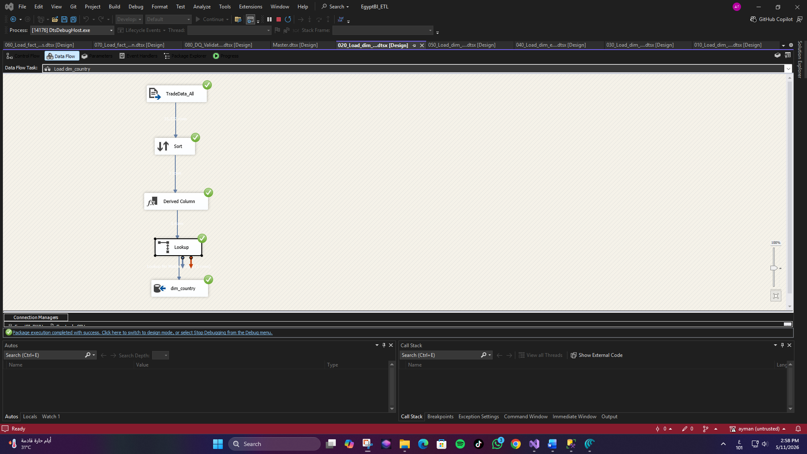
  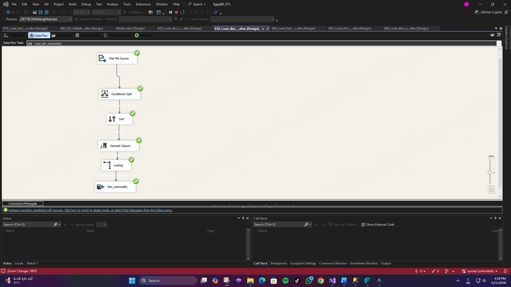
  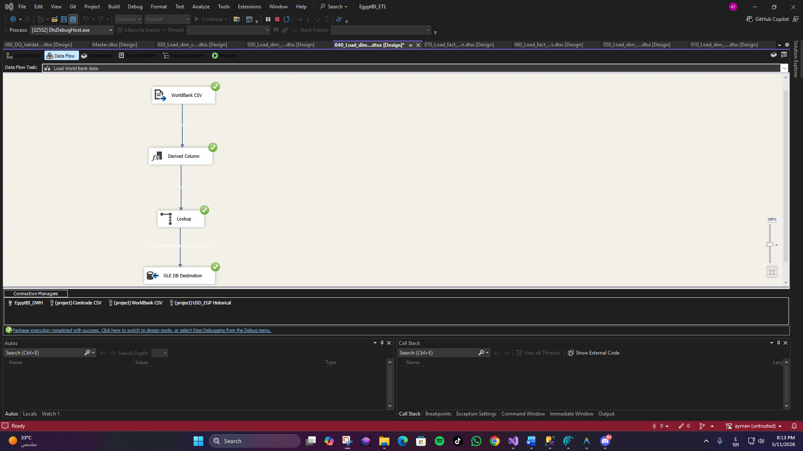
  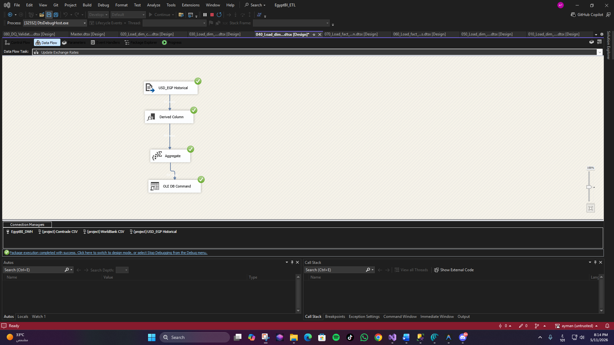
  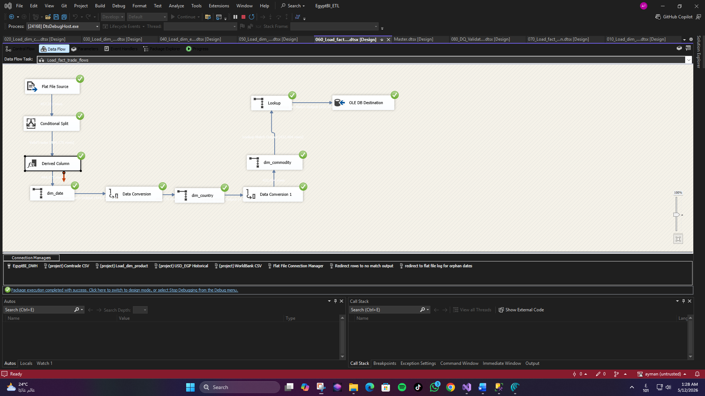
  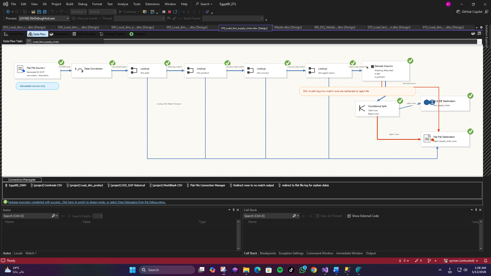
  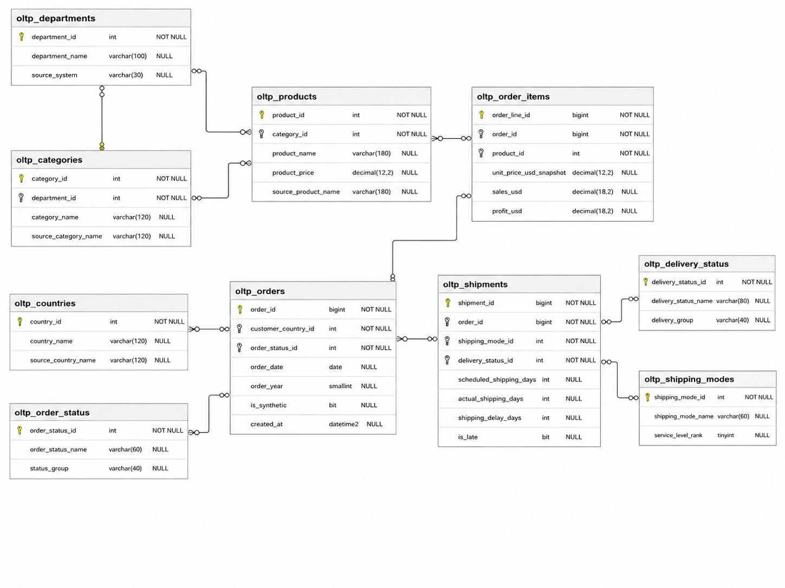
</p>
</details>

---

## 💡 Bypassing the Power BI Embedded License Barrier

A major technical highlight — we enabled public report viewing without purchasing a dedicated Power BI Embedded capacity node:

1. Created a shared **Demo Microsoft Account**
2. Added the account as a **Guest user** to our university tenant via Azure AD
3. Granted the demo account **Viewer access** on the Fabric workspace
4. Activated the **Microsoft Fabric Trial** (60 days free) — enabling paginated RDL reports without Premium capacity
5. Integrated the demo account into our web app with a custom "Demo Account" modal for seamless visitor access

---

## 📊 Power BI Dashboard

The interactive Power BI dashboard features **10+ report pages** covering:
- **Executive Cockpit:** High-level KPIs, trade balance, GDP trends
- **Trade Analytics:** Import/export trends, year-over-year growth
- **Supply Chain KPIs:** OTIF %, late delivery %, cancellation rates
- **Risk & Fraud:** Suspected fraud detection, risk scoring
- **Time Intelligence:** Date-based drill-down, crisis period overlays
- And more!

<details>
<summary>📸 Click to expand Dashboard & Web App Screenshots</summary>

<p align="center">
  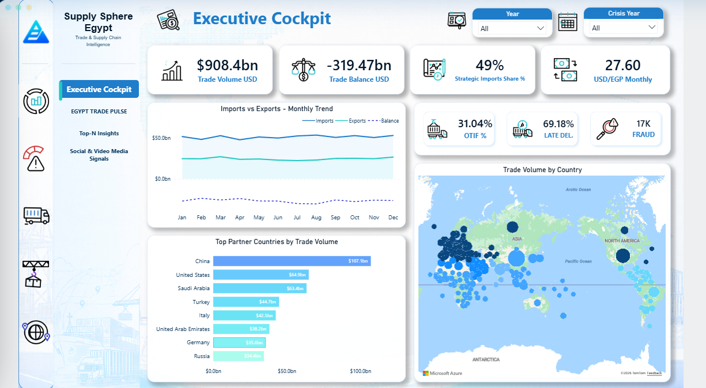
  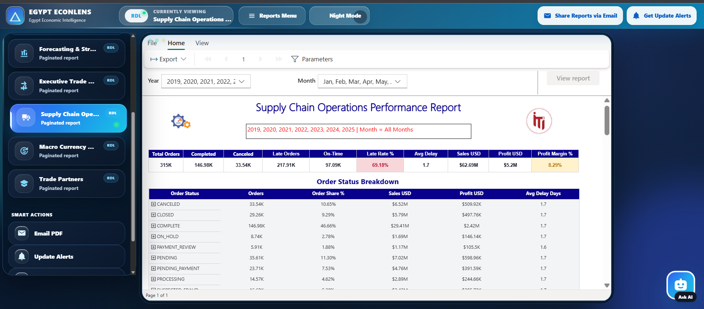
  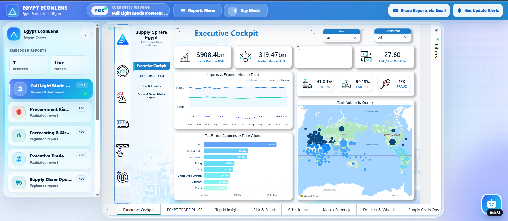
  
</p>
</details>

---

## ☁️ Microsoft Fabric & Power Automate

The local SQL Server Data Warehouse can be migrated to **Microsoft Fabric Synapse Data Warehouse** for cloud-scale analytics. Furthermore, we developed an automation suite to handle report subscriptions and automated email alerts.

<details>
<summary>📸 Click to expand Microsoft Fabric & Power Automate screenshots</summary>

<p align="center">
  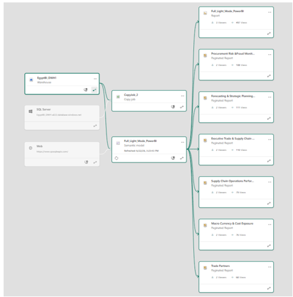
  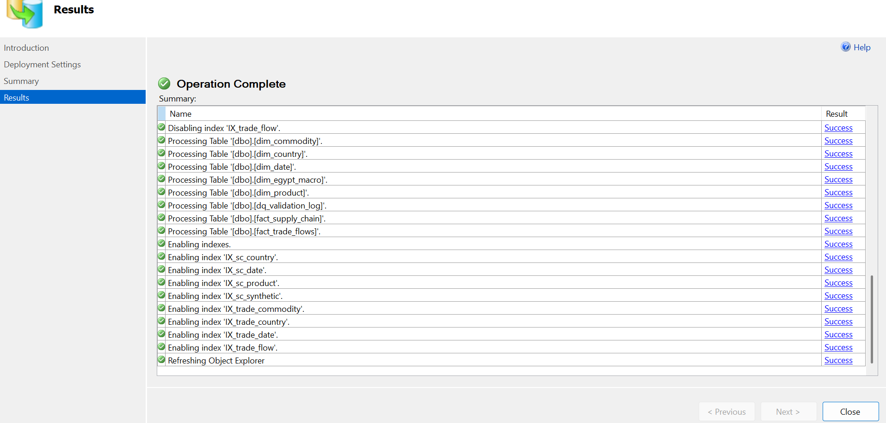
  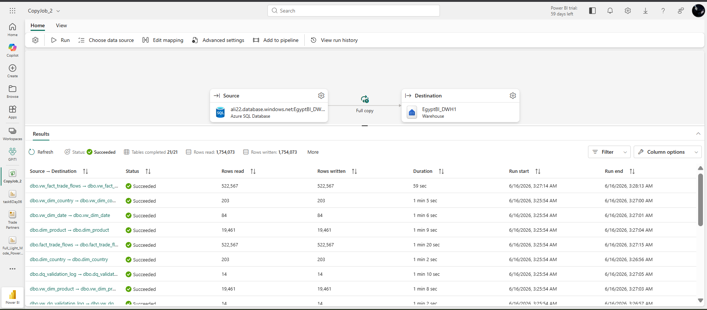
  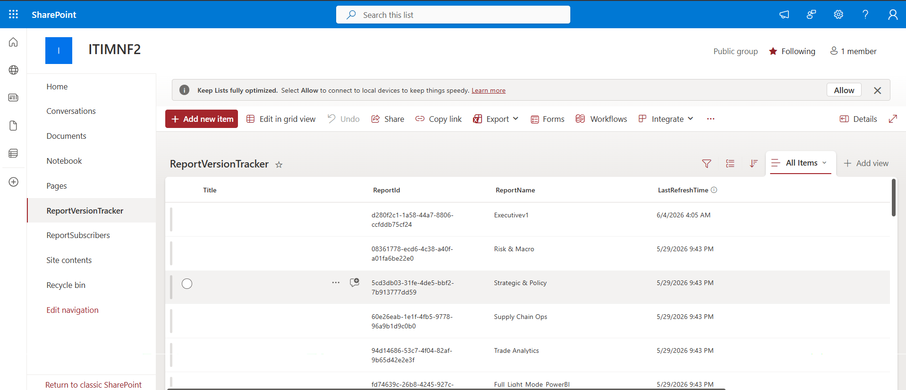
  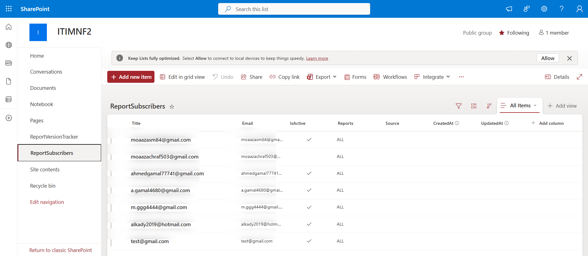
</p>

### Power Automate Flows & Email Templates
<p align="center">
  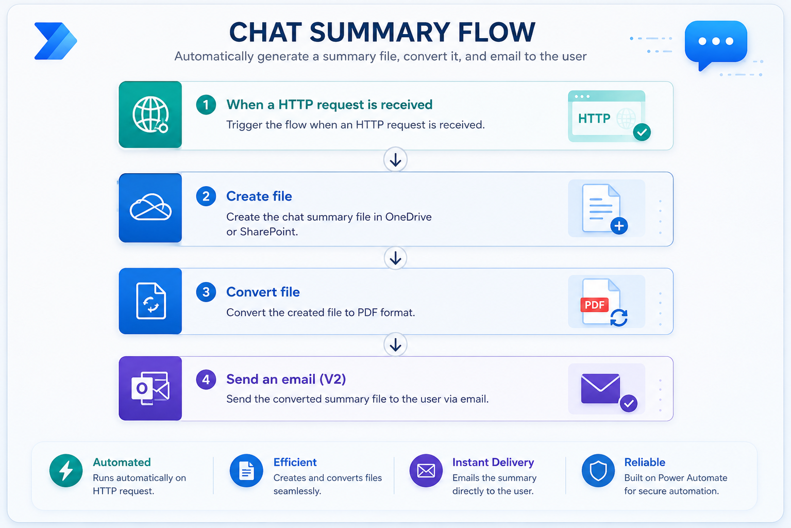
  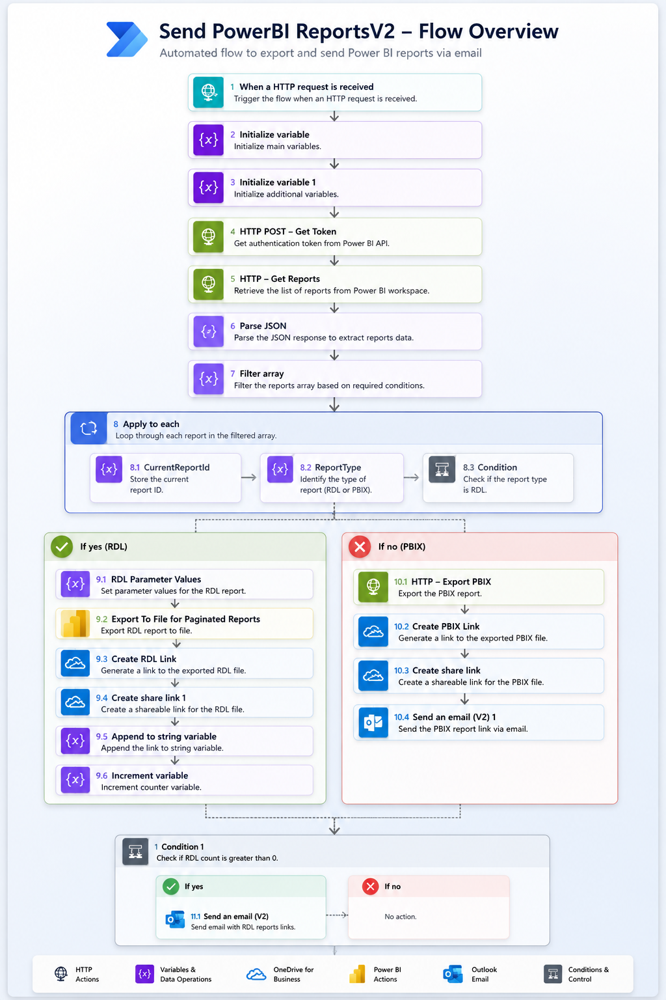
  
  
  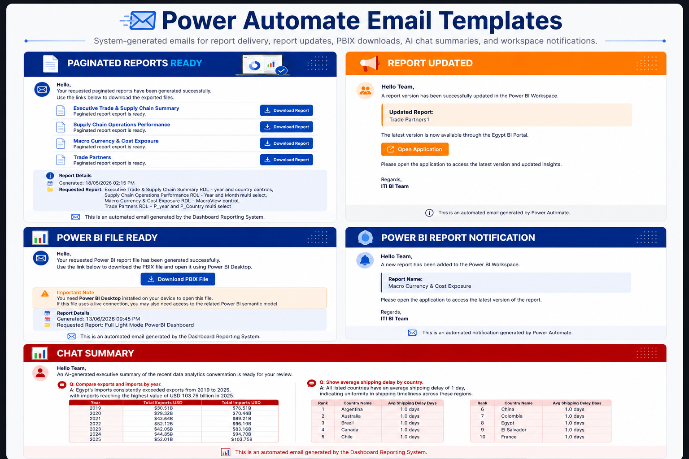
</p>
</details>

---

## 💻 Installation & Local Setup

### 1. Prerequisites

- **Python 3.10+**
- **SQL Server 2019+ & SSMS**
- **ODBC Driver 17** for SQL Server
- An **OpenRouter API Key** for the AI Copilot

### 2. Clone & Setup

```bash
git clone https://github.com/moaaz311/FinalProjectAPP.git
cd FinalProjectAPP

# Create virtual environment
python -m venv .venv

# Activate (Windows)
Set-ExecutionPolicy -Scope Process -ExecutionPolicy Bypass
.\.venv\Scripts\Activate.ps1
# On Linux/macOS: source .venv/bin/activate
```

### 3. Database Restoration

- Download the data files and database backup from [Google Drive](https://drive.google.com/drive/u/0/folders/15fnZJjcYtHDwM4jHUdfjSmm11OHchYoX).
- Restore the `EgyptBI_DWH1_Compressed.bak` backup in SSMS.
- Run `stored_procedures_FIXED.sql` to deploy the required stored procedures.

### 4. Install Dependencies

```bash
pip install --upgrade pip
pip install -r requirements.txt
```

### 5. Environment Variables

Create a `.env` file in the root directory (use `.env.example` as a template):

```env
# AI API
OPENROUTER_API_KEY=your_openrouter_api_key

# App Settings
HTTP_REFERER=http://localhost:5000
X_TITLE=EgyptTradeAI

# Database
SQL_SERVER=YOUR_SERVER_NAME
SQL_DATABASE=EgyptBI_DWH1

# Email (Flask-Mail)
MAIL_USERNAME=your_email@gmail.com
MAIL_PASSWORD=your_app_password

# Power Automate
POWER_AUTOMATE_URL=your_power_automate_pdf_flow_url
SUBSCRIBE_FLOW_URL=your_subscribe_flow_url
UPDATE_SUBSCRIBERS_FILE=data/update_subscribers.json
SUBSCRIBERS_API_KEY=your_secret_key
```

> ⚠️ **CRITICAL:** Never commit your `.env` file!

### 6. Run the App

```bash
python app2.py
```
Open **http://127.0.0.1:5000** — you'll be greeted by the premium EconLens UI.

---

## 📂 Project Structure

```
📦 Egypt-EconLens/
├── 🐍 app2.py                           # Flask Web App entry point
├── 📄 requirements.txt                  # Python dependencies
├── 📄 .env.example                      # Configuration template
├── 📊 Full_Light_Mode_PowerBI.pbix      # Power BI dashboard
├── 📜 stored_procedures_FIXED.sql       # 21 DWH stored procedures
├── 📂 SSIS_Packages/                    # SSIS ETL packages
├── 📂 middleware/                       # AI Assistant query and prompt logic
│   ├── prompt_builder.py                #   ├── Prompt construction
│   ├── schema_retriever.py              #   ├── DWH metadata lookup
│   └── sql_validator.py                 #   └── SQL validation and repair
├── 📂 templates/                        # HTML UI pages
├── 📂 static/                           # UI Assets & Styling
├── 📂 knowledge/                        # LLM context references
└── 📂 data/                             # Sample data files
```

---

## 🔍 Key Insights Discovered

- **Trade Deficit**: Egypt maintains a persistent trade deficit, widening significantly during crisis years.
- **Currency Impact**: EGP depreciation correlates strongly with rising import costs and inflation spikes.
- **Supply Chain**: Identified patterns in OTIF rates, late deliveries by shipping modes, and isolated suspected fraud.
- **Crisis Resilience**: Measured exact impact of the 2022 devaluation and COVID-19 supply chain disruptions.

---

## 👥 Team

This project was developed as a graduation project for the **ITI Business Intelligence Track 2026**.

<table>
  <tr>
    <td align="center">
      <a href="https://github.com/3bslam">
        <br />
        <sub><b>Ayman Abd Elsalam</b></sub>
      </a><br />
      <sub>Data Engineer & DWH Specialist</sub><br />
      <a href="https://www.linkedin.com/in/ayman-abd-elsalam-5b2131381/">
        
      </a>
    </td>
    <td align="center">
      <a href="https://github.com/shaimaahesham">
        <br />
        <sub><b>Shaimaa Hesham</b></sub>
      </a><br />
      <sub>BI & AI Solutions Developer</sub><br />
      <a href="https://www.linkedin.com/in/shaimaa-hesham/">
        
      </a>
    </td>
    <td align="center">
      <a href="https://github.com/mahmoud113647">
        <br />
        <sub><b>Mahmoud Reda</b></sub>
      </a><br />
      <sub>Power BI Developer</sub><br />
      <a href="https://www.linkedin.com/in/mahmoud-aboali-539130389/">
        
      </a>
    </td>
    <td align="center">
      <a href="https://github.com/emanemysalah3-ai">
        <br />
        <sub><b>Eman Salah</b></sub>
      </a><br />
      <sub>Power BI Developer</sub><br />
      <a href="https://www.linkedin.com/in/emansalahahmed/">
        
      </a>
    </td>
    <td align="center">
      <a href="https://www.linkedin.com/in/moaaz-achraf/">
        <br />
        <sub><b>Moaaz Ashraf</b></sub>
      </a><br />
      <sub>Cloud, Automation & Platform Engineer</sub><br />
      <a href="https://www.linkedin.com/in/moaaz-achraf/">
        
      </a>
    </td>
  </tr>
</table>

<p align="center"><i>"Turning Data into Decisions"</i></p>

---

## 📖 Documentation

- 📄 **[Project Documentation](https://docs.google.com/document/d/1_hmX6N-lVjhbMK2UnSVNv8LMq9YESnhg/edit?usp=sharing&ouid=116185672424717190455&rtpof=true&sd=true)** — Full project pitch, methodology, and analysis

<p align="center">
  Made with ❤️ by the ITI BI 2026 Team
</p>
